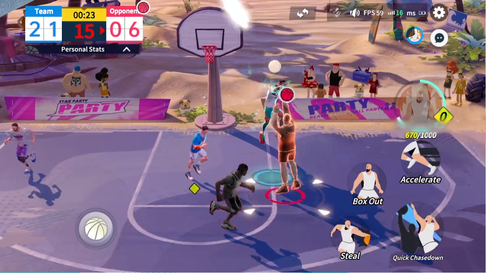

# Dunk City Dynasty: Multi-Agent Basketball Environment

This repository contains an RL environment based on a commercial online basketball game named [Dunk City Dynasty](https://www.dunkcitymobile.com/). It was created by the [Netease Leihuo Technology](https://leihuo.163.com/) and the [Netease FuXi AI lab](https://fuxi.163.com/) for research purposes.


## Content

- [Overview](#overview)
- [QuickStart](#quickStart)
- [QA](#QA)
- [Appendix](#appendix)

## Overview

|  |  |
| ----------------------------- | --------------------------- |

Dunk City Dynasty is an exciting new multiplayer online basketball game developed by NetEase Games. In this game, players can select their favorite characters to compete in thrilling 3v3 street basketball matches. The game features an impressive roster of player-controlled characters, including popular stars from the National Basketball Association (NBA) like LeBron James, Kevin Durant, Stephen Curry, and many more, each with unique abilities and skills. To succeed in matches and climb the rankings, players must utilize their skills and strategies. For additional information about the game, please visit the official website at https://www.dunkcitymobile.com/.

### Docs

More details about the environment info can be found at [docs](https://fuxirl.github.io/DunkCityDynasty).

## QuickStart

### Installation

To install the Dunk City Dynasty Environment, simply follow these steps: 

1. Download the repository using the following command:

   ```
   git clone https://github.com/FuxiRL/DunkCityDynasty.git
   ```

2. For Linux system users (MacOS not supported currently), in order to run the Dunk City Dynasty client, you will need to install wine and several other required components. This can be done either by using the `install.sh` script or by utilizing `docker`. Here are the relevant commands:

   ```sh
   # (Only for Ubuntu System) Install components
   ./install_deps.sh
   
   # Install components via docker
   docker build -t dunk_city_dynasty_env:v1.0 .
   ```

3. Finally, install the relevant Python packages. (Please note that at present, we only support Python version 3.8.)

   ```sh
   # need install anaconda first
   conda create -n dunk_city_dynasty python=3.8
   conda activate dunk_city_dynasty
   
   pip install -r requirements.txt
   ```

### Get start


After installing the corresponding components, we can run the Dunk City Dynasty Environment with the following python code.

```python
config = {
    'id': 1,
    'env_setting': 'win',                   # or 'linux' for ubuntu system
    'client_path': 'path-of-game-client',
    'rl_server_ip': '127.0.0.1',            # ip of the rl server
    'rl_server_port': 6666,                 # port of the rl server
    'game_server_ip': 'xxxxxxx',            # ip of the game server (we will provide a public IP address and port later)
    'game_server_port': 6667,               # port of the game server (we will provide a public IP address and port later)
    'machine_server_ip': '',                # ip of remote machineserver (for multi machine setting)
    'machine_server_port': 0,               # port of remote machineserver (for multi machine setting)
    'user_name': 'xxxxxxx',                 # user name of the game account
    }

env = GymEnv(config)

states, infos = env.reset()
while True:
    action = {key: random.randint(0, 20) for key in states}
    states, rewards, dones, truncated, infos = env.step(action)
    print(action)
    if dones['__all__']:
        break
```

or, directly run the `get_start.py` file: 

```sh
python get_start.py
```

Please note that the following parameters need to be configured in the `get_start.py` file:

* `client_path`: the path of the game client
* `game_server_ip`: the IP address of the game server (given by the organizer)
* `user_name`:  the user name of the game account (given by the organizer)

### Multi-machine Support

The Dunk City Dynasty Environment currently supports both Windows and Linux systems. On Linux systems, the environments can be launched through Wine. In addition, the Dunk City Dynasty Environment supports multi-machine mode, where Linux is used for training and Windows for environment rollout, for example. To use the multi-machine mode, follow these steps:

1. Configure the relevant parameters in `multi_machine_server.py`
   - `CLIENT_PATH`: the path of the game client 
   - `GAME_SERVER_IP`: the IP address of the game server
   - `GAME_SERVER_PORT`: the port of the game server 
   - `MACHINE_SERVER_PORT`: the port of the machine server
2. Run `python multi_machine_server.py` to start the multi-machine server in Windows.
3. Configure the relevant parameters in `get_start.py`
   - `machine_server_ip`: the IP address of the machine server
   - `machine_server_port`: the port of the machine server
4. Finally, run `python get_start.py` to start the environment rollout in Linux.

### An easy training demo

Currently, we provide a simple training code based on the [rllib framework](https://www.ray.io/rllib). You can try to train the agent by running the following code.

RL training:

```sh
python ./baselines/torch/train_rl.py
```

BC training:

```sh
python ./baselines/torch/train_bc.py
```

## QA

##### The game crashes when executing the `get_start.py` file.

- If the game crashes when executing the `get_start.py` file for the first time, you can try executing it again.

##### When running `get_start.py` on an Ubuntu system, there is an issue with Wine getting stuck.

- Try quitting `get_start.py` and running the `get_start.py` file again. 

##### Game setting

- Game screen scaling: `Alt+Enter`.
- Turn off game rendering: set `disableGameRendering=1` in `./Lx33_Data/boot.config` 


## Appendix

- **Game Client: ([(HuggingFace Source Link)](https://huggingface.co/datasets/FUXI/DunkCityDunasty_GameClient), [(NetEase Source Link)](https://cdn.fuxi.netease.com/yaotai/zhongbao/xiyin/static/game_package_release.zip?auth_key=2639269098-0-0-da471a6bbe080df0e0a8c9d7d5bd4643))** The game client is an executable program for Dunk City Dynasty. The program can be run directly on Windows systems, or on Linux systems through Wine.
- **Human Data: ([(HuggingFace Source Link)](https://huggingface.co/datasets/FUXI/DunkCityDynasty_Dataset), [(NetEase Source Link)](https://cdn.fuxi.netease.com/yaotai/zhongbao/xiyin/static/L33_RELEASE.zip?auth_key=2639295363-0-0-daceb9a4565863011489134c3a8b6718))** The DunkCityDynasty dataset contains almost 400GB human data and records the state-action pairs of human players within a game (with approximately one frame recorded every 150ms). The state features include global game features (such as game time, score, etc.) and attribute features of six players (such as position, speed, orientation, etc.). The action features consist of 52-dimensional discrete actions, including noop, movement, passing, skills, etc. In terms of player roles, the DunkCityDynasty dataset provides player data for five roles: Phillip, Lolo, Doncic, Hayward, and Curry, which covers the basic positions in a basketball game. In terms of player ability segmentation, based on the actual segmentation of the game players, we divided the dataset into low, medium, and high-level player data, with little difference in the amount of player data in each segment.

